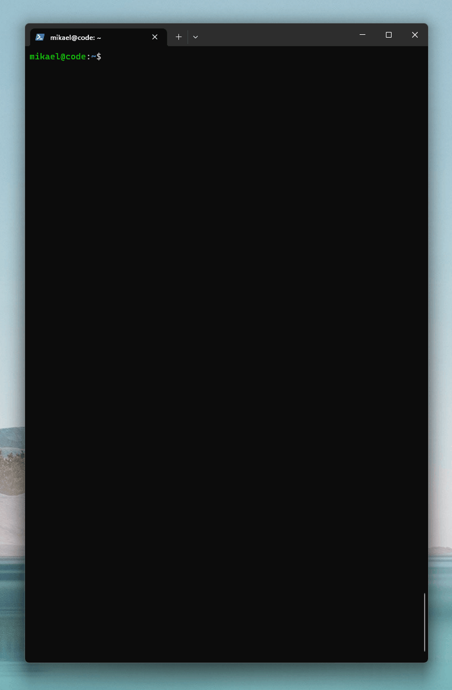

# 🖧 WireGuard Tunnel Generator
Hi and welcome! Click the button below if you enjoy the software and want to support my work. A lot of coffee is consumed as a software developer you know 😁

<a href="https://www.buymeacoffee.com/bitcanon" target="_blank"></a>

>Needless to say, this is completely voluntary.

## 🤓 Introduction
A simple bash script to speed up and simplify the deployment of WireGuard Road Warriors (mobile VPN clients) connecting to a MikroTik firewall running RouterOS.

The script will produce the RouterOS configuration required as well as a QR code to scan with the WireGuard mobile app. This will enable you to deploy a new mobile VPN client within a minute or two, and you don't have to send public keys back and forth between the mobile device and the router.

## 🕹 Demo
Here is a small command-line demo showing the WireGuard Tunnel Generator script in action.



## 💻 Installation
Download the script from GitHub and place it inside your home directory.

The script needs three packages in order to operate correctly:
```
sudo apt install ipcalc-ng wireguard-tools qrencode
```

1. `ipcalc-ng` is used to validate IP adress input.
2. `wireguard-tools` is used to generate private/public key pair.
3. `qrencode` is used to encode the WireGuard configuration into a QR code.

>The script has only been tested on Debian but might also work on other operating systems.

## 📚 Basics
### Parameters
The script accepts parameters you use to define the WireGuard configuration for each client deployed:
```bash
Usage:
  ./wg-tunnel-generator.sh [options] <mobile_peer_ip>

Options:
  <mobile_peer_ip>    Mobile peer IP address in CIDR notation, ie. 10.0.0.2/32
  -a <subnet,...>     One or more IP subnet(s) to be routed through the tunnel
  -d <dns,...>        One or more DNS server(s) to be used by the mobile client
  -e <host[:port]>    WireGuard endpoint on the firewall, ie. fw.example.com:13231
  -h                  Print this help and exit
  -n <name>           Descriptive name for the mobile client
  -p <public_key>     Public key of the WireGuard interface on the firewall
  -v                  Print verbose debugging information
```
The only required parameter is `<mobile_peer_ip>`, which is the IP address to be assigned to the client; all other parameters (options) have **default values** that will be used if not overridden by the parameters passed to the script. Read more about *default values* in the upcoming section.
Example:
```bash
./wg-tunnel-generator.sh -n my-phone -a 10.50.0.0/16 -d 1.1.1.1,8.8.8.8 -e vpn.example.com:13231 -p "fb4r8zxzstQ+/GxULwnqW9mqDF3YrBT2SvcEHyXqoWM=" 10.50.50.2/32
```

### Change the Defaults
The default options above can be modified simply by editing `wg-tunnel-generator.sh`. This can be handy if you don't want to pass parameters every time you need to deploy a new road warrior.

Most often the same settings will be used for all mobile clients and the only parameters we need to pass to the script is the `name` and the `mobile_peer_ip` address.

```bash
# Pre-defined parameter values
ALLOWED_IPS="0.0.0.0/0"
DNS="1.0.0.1,1.1.1.1"
ENDPOINT="fw.example.com:13231"
FW_PUBLIC_KEY="0"
NAME="mobile-phone"
```

To simplify the example in the last section we can change the variables to:
```bash
# Pre-defined parameter values
ALLOWED_IPS="10.50.0.0/16"
DNS="1.1.1.1,8.8.8.8"
ENDPOINT="vpn.example.com:13231"
FW_PUBLIC_KEY="fb4r8zxzstQ+/GxULwnqW9mqDF3YrBT2SvcEHyXqoWM"
NAME="mobile-phone"
```
Now we can run the following command and still get the same result:
```bash
./wg-tunnel-generator.sh -n my-phone 10.50.50.2/32
```

## 🖧 WireGuard Interface Configuration
One thing to keep in mind when running the script is whether a **WireGuard Interface** has been configured on the router or not.

This is important because we only need one interface for the WireGuard endpoint on the router (assuming that all VPN clients are put on the same subnet). 

If the interface is created from RouterOS, the private/public key pair is generated automatically. If not, just let the script create the configuration for you.
 
### WireGuard Interface is configured

When the interface is pre-configured you need to get the **public key** from the configuration in RouterOS.

**WinBox**:
- Go to WireGuard, open the `wg_mobile` interface in the WireGuard tab and *copy the public key*.

**Terminal**:
- Run the command `:put ([/interface/wireguard/get wg_mobile ]->"public-key")` and *copy the public key*.

>Here we assume that the name of the WireGuard interface is `wg_mobile`.

### WireGuard Interface need to be configured

When the interface doesn't exists you can have the script generate the configuration for you; this is the *default behavior* of the script and is also demonstrated in the example screenshot at the top.

There are two ways to change this behavior:
1. Pass the **public key** as an argument to the script: `-p "fb4r8zxzstQ+/GxULwnqW9mqDF3YrBT2SvcEHyXqoWM="`
2. Set the variable `FW_PUBLIC_KEY` to the public key you got from the WireGuard interface in RouterOS, for instance `FW_PUBLIC_KEY=fb4r8zxzstQ+/GxULwnqW9mqDF3YrBT2SvcEHyXqoWM=`.

## 🕹️ Running the Script
When the script is run there are a few things that are happening.

### Client Secrets
Every time the script is run we:
1. Generate new private/public keys for the mobile client.
2. Generate a new shared secret. This is a random string of characters (Base64 encoded).

### RouterOS Secrets
Every time the script:
1. Is run **without** `-p`, a new private/public key pair is generated.
2. Is run **with** `-p`, the existing private/public key pair generated in RouterOS, is used. The same goes when the variable `FW_PUBLIC_KEY` is set as described above.
>The private and public keys of the firewall is only created once and then used by all clients.

### WireGuard Configuration
The WireGuard configuration to be imported into the WireGuard client is exported into a configuration file with the name provided by the `-n` argument.

As an example, this command:
```bash
./wg-tunnel-generator.sh -n my-phone 10.50.50.2/32
```
Will save the WireGuard configuration in the file `./configs/my-phone.conf`:
```bash
[Interface]
Address = 10.50.50.2/32
PrivateKey = 4NhTvZkoPoUyG4Vc6bVA6bnqaH+2pyWioJr5mXiDMFw=
DNS = 1.0.0.1,1.1.1.1

[Peer]
PublicKey = fb4r8zxzstQ+/GxULwnqW9mqDF3YrBT2SvcEHyXqoWM=
Endpoint = fw.example.com:13231
PresharedKey = 0zQbfFxCWf+v3j0uiaS+ozAPDdwRHIQktAjnMcST9wo=
AllowedIPs = 0.0.0.0/0
```

### QR Code
The configuration in the **WireGuard Configuration** section above will also be encoded into a QR code using the `qrencode` utility.

This QR code will:
1. Be printed as text in the **terminal** for instant use.
2. Saved into a **PNG image** file `./configs/my-phone.png`. 

### RouterOS Configuration
The RouterOS configuration needed in order to get the tunnel up and running will also be available for you.

The configuration will:
1. Be printed as text in the **terminal** for instant use; just copy and paste into RouterOS.
2. Saved into a **RouterOS Script** file `./configs/my-phone.rsc`. 

## Further Reading
For more information on how to setup a WireGuard Tunnel between a mobile device and MikroTik RouterOS:
* https://help.mikrotik.com/docs/display/ROS/WireGuard#WireGuard-RoadWarriorWireGuardtunnel
